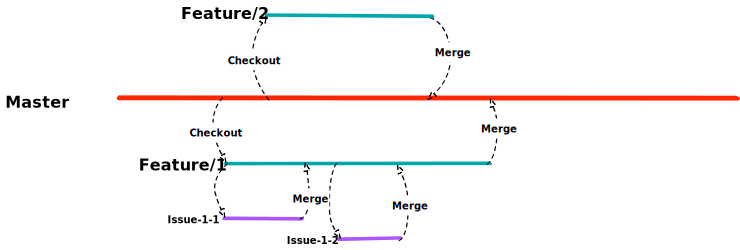

# gitlab-flow

[](https://goreportcard.com/report/github.com/yeqown/gitlab-flow) [](https://pkg.go.dev/github.com/yeqown/gitlab-flow)

A CLI tool to help manage the flow of developing on gitlab. The difference between this and `git-flow` is that 
`gitlab-flow` would operate remote(gitlab) resources like: milestone, issue, merge request and branch. Importantly,
if your team using `gitlab-flow` together, `gitlab-flow` could help you to synchronize others development data by
using `milestoneId` or interactive mode. 


### Installation

There is no precompiled binary to install directly, so you need to install by yourself.

```shell
go install github.com/yeqown/gitlab-flow/cmd/gitlab-flow

# if you cannot install directly, try following command,
# then input install command again
go get -u github.com/yeqown/gitlab-flow
```

### Initialization

```shell
gitlab-flow [-c, --conf_path `path/to/confpath/`] init -s "YOUR_GITLAB_ACCESS_TOKEN" -d "YOUR_GITLAB_API_HOST"
# Notice here, global flag is before subcommand `init` or others.
# -c only need a directory path not file path.
```

#### Access Token

You can find or create your own access token in: 

[https://git.example.com/profile/personal_access_tokens](https://git.example.com/profile/personal_access_tokens).

Then you need to choose `api, read_user, read_repository, read_registry` scopes.

#### API Host

You can find it in:

[https://git.example.com/help/api/README.md](https://git.example.com/help/api/README.md).

This page provide some example for you to request gitlab API, so you got host.

### CLI Help  

```shell
$ flow -h
NAME:
   gitlab-flow - CLI tool

USAGE:
   flow2 [global options] command [command options] [arguments...]

VERSION:
   v1.6.2

DESCRIPTION:
   A tool for managing gitlab Feature/Milestone/Issue/MergeRequest as gitlab-flow.

AUTHOR:
   yeqown <yeqown@gmail.com>

COMMANDS:
   help, h  Shows a list of commands or help for one command
   dash:
     dash  overview of local development
   flow:
     feature  managing the works in developing.
     hotfix   managing the works in hotfix.
   init:
     init  initialize gitlab-flow, generate default config file and sqlite DB related to the path

GLOBAL OPTIONS:
   --conf_path path/to/file, -c path/to/file  choose which path/to/file to load (default: ~/.gitlab-flow)
   --cwd path/to/file                         choose which path/to/file to load (default: /Users/med/projects/opensource/gitlab-flow)
   --debug                                    verbose mode (default: false)
   --project projectName, -p projectName      input projectName to locate which project should be operate. (default: gitlab-flow)
   --force-remote                             query project from remote not from local. This should be used when project name is duplicated, and could not found from local. (default: false)
   --web                                      open web browser automatically or not (default: false)
   --help, -h                                 show help (default: false)
   --version, -v                              print the version (default: false)
```

### Documents



More help information is [HERE](./assets/README.md).