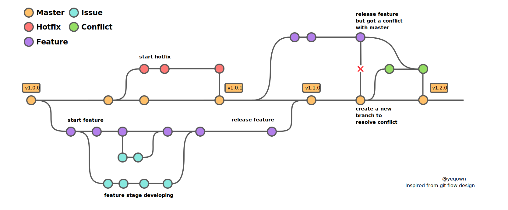

# gitlab-flow

[](https://goreportcard.com/report/github.com/yeqown/gitlab-flow) [](https://pkg.go.dev/github.com/yeqown/gitlab-flow)

[中文文档](./README.zh-CN.md)

A CLI tool to help manage the flow of developing on gitlab. The difference between this and `git-flow` is that 
`gitlab-flow` would operate remote(gitlab) resources like: milestone, issue, merge request and branch. Importantly,
if your team using `gitlab-flow` together, `gitlab-flow` could help you to synchronize others development data by
using `milestoneId` or interactive mode. 


### Installation

Before you install `gitlab-flow`, you need apply a gitlab application on your gitlab server.

1. Go to your gitlab `Preferences` -> `Applications`.
2. Input `Name` and `Redirect URI` (http://localhost:2333/callback).
3. Choose scopes: `api`, `read_user`, `read_repository`, `read_registry`.
4. Click `Save application`.
5. Copy `Application Id` and `Secret`.

Now, you got `Application Id` and `Secret`.

There is no precompiled binary to install directly, so you need to install by yourself.

```shell
APP_ID=YOUR_GITLAB_APP_ID \
APP_SECRET=YOUR_GITLAB_APP_SECRET \
BIN=gitlab-flow \ # or any name you like
bash install.sh
```

### Bash/Zsh Completion

`gitlab-flow` using urfave/cli, so you can use `complete` command to generate completion script.

1. Download urfave/cli completion script to a file from [auto-completion](https://github.com/urfave/cli/tree/main/autocomplete)
2. Copy the content of the file to your shell folders. 
3. Source the file in your shell profile file.

```shell
# zsh completion for example
# download completion script
curl -L https://raw.githubusercontent.com/urfave/cli/master/autocomplete/zsh_autocomplete -o ~/.oh-my-zsh/cache/completions/gitlab-flow

# source the file in your .zshrc
echo "source ~/.oh-my-zsh/cache/completions/gitlab-flow" >> ~/.zshrc

# activate the completion
source ~/.zshrc
```

More help information, you can find in [urfave/cli](https://cli.urfave.org/v2/examples/bash-completions/) bash completion.

### Initialization

```shell
gitlab-flow [-c, --conf `path/to/confpath/`] init
# Notice here, global flag is before subcommand `init` or others.
# -c only need a directory path not file path.
```

#### Access Token

***❗️❗️❗️NOTICE: since `1.7.0` gitlab-flow use OAuth2 access token instead of personal access token.***

> !!! Before initialize gitlab-flow, you must have a custom-compiled gitlab-flow executable binary 
> which contains appId and appSecret of gitlab application on your gitlab server.

After you initialize gitlab-flow on your machine, it will automatically request OAuth credentials
from your gitlab server.

> Host: The domain of your gitlab server. such as https://git.example.com 
> 
> API Host: The API path to your gitlab server. such as: https://git.example.com/api/v4/. 
> You can find it in:
[https://git.example.com/help/api/README.md](https://git.example.com/help/api/README.md).
This page provide some example for you to request gitlab API, so you got host.

### CLI Help  

```shell
$ flow -h
NAME:
   gitlab-flow - CLI tool

USAGE:
   flows [global options] command [command options] [arguments...]

VERSION:
   v1.6.2

DESCRIPTION:
   A tool for managing gitlab Feature/Milestone/Issue/MergeRequest as gitlab-flow.

AUTHOR:
   yeqown <yeqown@gmail.com>

COMMANDS:
   help, h  Shows a list of commands or help for one command
   dash:
     dash  overview of local development
   flow:
     feature  managing the works in developing.
     hotfix   managing the works in hotfix.
   init:
     init  initialize gitlab-flow, generate default config file and sqlite DB related to the path

GLOBAL OPTIONS:
   --conf path/to/file, -c path/to/file  choose which path/to/file to load (default: ~/.gitlab-flow)
   --cwd path/to/file                         choose which path/to/file to load (default: /Users/med/projects/opensource/gitlab-flow)
   --debug                                    verbose mode (default: false)
   --project projectName, -p projectName      input projectName to locate which project should be operate. (default: gitlab-flow)
   --force-remote                             query project from remote not from local. This should be used when project name is duplicated, and could not found from local. (default: false)
   --web                                      open web browser automatically or not (default: false)
   --help, -h                                 show help (default: false)
   --version, -v                              print the version (default: false)
```

### [Documents](./docs/README.md)

This section records the documents of `gitlab-flow`, including the design, the usage, the development and the release.

### [Changelog](./CHANGELOG.md)

CHANGELOG.md records the changes of each version. 