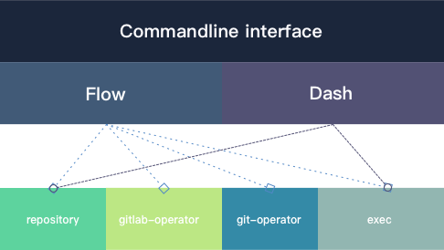

## Contents

* #### [Examples](./example.md)

	Provides some examples to work with `gitlab-flow`.

* #### [Configuration](./conf.md)

	Introduces configuration of `gitlab-flow`.

* #### [Branch Flow](./flow.md)

	Describes the life cycle of branch creating, merge, checkout. 

* #### [CLI Autocomplete](./autocomplete.md)

  Introduces how to enable autocomplete of `gitlab-flow` CLI.  

