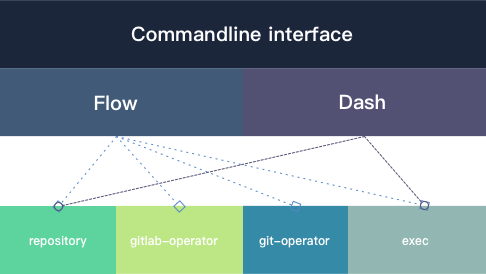

## 目录

* #### [示范](./example.md)

  提供了一些`gitlab-flow`中的命令的使用示范。

* #### [配置](./conf.md)

  介绍`gitlab-flow`的配置文件。

* #### [分支管理模型](./flow.md)

  描述了`gitlab-flow`使用的分支管理模型。

* #### [命令行自动补全](./autocomplete.md)

  这部分介绍如何配置和使用`gitlab-flow`的命令自动补全。

